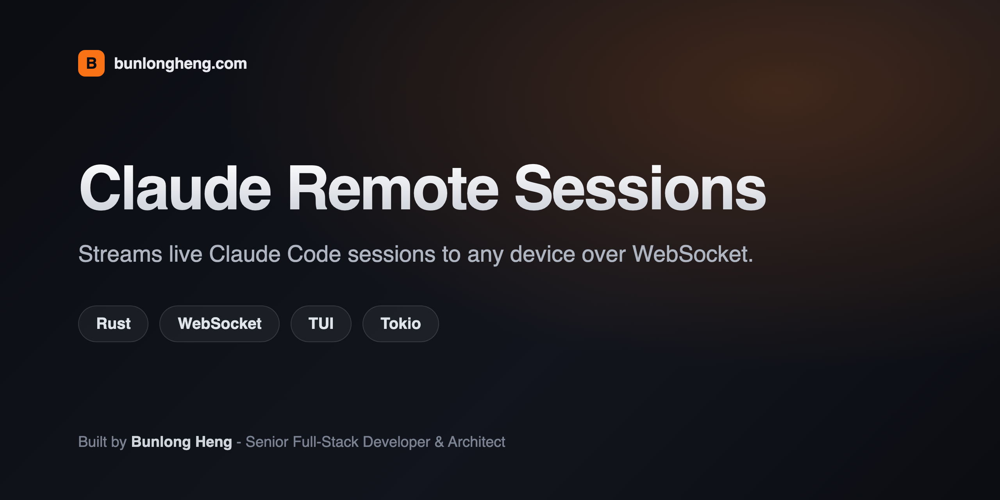
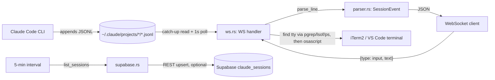

<div align="center">

# claude-live

<p align="center"></p>


A Rust WebSocket server that tails your local Claude Code session files and streams the parsed conversation - thinking, tool calls, text, todos, token usage - live to any client, with optional Supabase sync and remote input injection back into the terminal.

[](LICENSE)


</div>

## Features

- **Session discovery** - scans `~/.claude/projects/*/*.jsonl` and lists every Claude Code session with project name, cwd, git branch, Claude Code version, message count, active/stale flag (`ACTIVE_THRESHOLD_SECS`, default 600s), and the last token-usage snapshot.
- **Live event stream** - `GET /ws/<session_id>` replays the last 100 parsed events for catch-up, sends a `ready` event, then tails the session's JSONL file every second and pushes new events as they land.
- **Typed event parsing** - raw JSONL lines are turned into `thinking`, `tool`, `text`, `user_msg`, `todos`, and `usage` events. Tool calls get a human-readable one-line summary (e.g. the command for `Bash`, the path for `Read`/`Edit`/`Write`, the pattern for `Grep`/`Glob`).
- **REST snapshot API** - `/api/health`, `/api/sessions`, `/api/sessions/:id` for clients that just want a poll instead of a socket.
- **Remote input injection** - `POST /api/sessions/:id/input` or a `{"type":"input","text":"..."}` WebSocket message locates the tty of the Claude process running in that session's cwd (via `pgrep` + `lsof` + `ps`) and types the text back into it through AppleScript: directly into iTerm2 with a bracketed-paste-safe two-step write, or by focusing VS Code's integrated terminal and driving System Events keystrokes as a fallback.
- **Optional Supabase sync** - if `SUPABASE_URL` and `SUPABASE_SERVICE_KEY` are set, a background task upserts every session's metadata (including token usage) to a `claude_sessions` table every 5 minutes. Leave them unset and the whole path is skipped.
- Open CORS (`Any`/`Any`/`Any`) - built for trusted local/LAN use, not a public API.

## How it works

Claude Code writes one append-only `.jsonl` file per session under `~/.claude/projects/<project>/<session_id>.jsonl`. claude-live doesn't watch the filesystem for change events - it reads the file once on WebSocket connect, then polls its size on a 1-second `tokio::interval` and reads only the new bytes each tick, so it never re-parses the whole file.



Each JSONL line is one `user` or `assistant` turn. `parser::parse_line` maps it to at most one `SessionEvent`: todos and plain text come from `user` lines, thinking/text/tool_use/usage come from `assistant` lines. Input injection is one-way and best-effort - if no matching tty is found, or neither the iTerm2 nor the VS Code AppleScript path succeeds, the caller gets `{"ok": false}` back.

## Tech stack

| Layer | Choice |
|-------|--------|
| Language | Rust (edition 2021) |
| Async runtime | Tokio |
| HTTP + WebSocket | Axum 0.7 (`ws` feature) |
| CORS | tower-http |
| Serialization | serde / serde_json |
| Time formatting | chrono |
| HTTP client (Supabase) | reqwest |
| Config | dotenv + env vars |
| Logging | tracing / tracing-subscriber |
| Errors | anyhow |
| Terminal injection | AppleScript via `osascript` (iTerm2, VS Code) |

## Getting started

```bash
git clone https://github.com/bunlongheng/claude-live.git
cd claude-live
cp .env.example .env   # optional - all vars have defaults except Supabase
cargo run --release
```

The server binds `0.0.0.0:$PORT` (default `7878`) and reads sessions straight from `~/.claude/projects`, so nothing to seed - it picks up whatever Claude Code has already written.

```
claude-live  http://0.0.0.0:7878
  WS endpoint:   ws://0.0.0.0:7878/ws/<session_id>
  Sessions API:  http://0.0.0.0:7878/api/sessions
```

### Configuration (`.env`)

| Variable | Default | Purpose |
|----------|---------|---------|
| `PORT` | `7878` | Port the HTTP/WS server listens on |
| `ACTIVE_THRESHOLD_SECS` | `600` | Sessions with no writes for longer than this are marked `active: false` |
| `SUPABASE_URL` | unset | Enables the background sync task when set together with the key below |
| `SUPABASE_SERVICE_KEY` | unset | Service-role key used for the Supabase upsert |
| `RUST_LOG` | `claude_progress=info,tower_http=warn` | Standard `tracing` env filter |

## API reference

| Method | Path | Purpose |
|--------|------|---------|
| GET | `/api/health` | `{"status":"ok","service":"claude-progress"}` |
| GET | `/api/sessions` | All discovered sessions, sorted active-first then most recent |
| GET | `/api/sessions/:id` | One session's metadata, 404 if the id isn't found |
| POST | `/api/sessions/:id/input` | Body `{"text":"..."}` - injects text into that session's terminal |
| GET (WS) | `/ws/:session_id` | Live event stream for one session |

### WebSocket events (server -> client)

| Event | Payload |
|-------|---------|
| `ready` | `{"session_id": "..."}` - sent once catch-up replay finishes |
| `thinking` | `{"text", "timestamp"}` |
| `tool` | `{"name", "summary", "timestamp"}` |
| `text` | `{"text", "timestamp"}` |
| `user_msg` | `{"text", "timestamp"}` (truncated to 300 chars) |
| `todos` | `{"todos": [{"id","subject","status","description?","active_form?"}], "timestamp"}` |
| `usage` | `{"input_tokens","output_tokens","cache_read","cache_creation","model","timestamp"}` |
| `error` | `{"message"}` - sent once if the session id doesn't resolve to a file |

### WebSocket message (client -> server)

`{"type": "input", "text": "..."}` - triggers the same tty-injection path as the REST endpoint; the server replies with `{"event":"input_ack","data":{"ok": true|false}}`.

## License

[MIT](LICENSE) (c) Bunlong Heng

---

<p align="center">
  <sub>Built by <a href="https://bunlongheng.com">Bunlong Heng</a> &middot; <a href="https://bunlongheng.com/projects/claude-desktop">See it in my portfolio &rarr;</a></sub>
</p>
